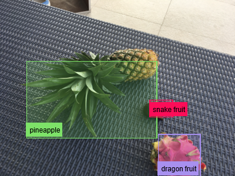
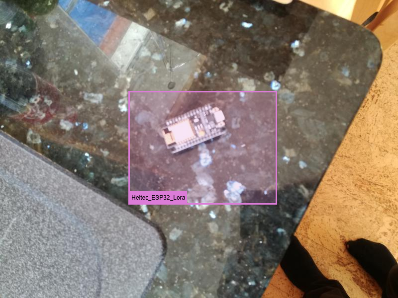

# 🐺 WolfDetector 🐺 

## Easily train your computer to detect ANYTHING 🔎🖼🚀

WolfDetector is a visual object detection library focusing on ease of use and accessibility. It is implemented in the Wolfram Language. The only thing you need to install to get started is [the Wolfram Engine](https://www.wolfram.com/engine/) (currently a 1GB download, cross-platform).

WolfDetector is based on the [YOLOv2 neural network architecture](https://arxiv.org/abs/1612.08242v1), and it uses a [pre-trained model](https://resources.wolframcloud.com/NeuralNetRepository/resources/YOLO-V2-Trained-on-MS-COCO-Data_1) to speed up training time and reduce the number of training examples you need for your dataset. Because of this, training can be done quickly with only a laptop CPU.

Additionally, WolfDetector can take advantage of Nvidia GPU technology to make training even *faster*.

## Getting Started
Object detection the problem of locating objects in an image. WolfDetector is a program which learns to do object detection by learning from data. To train WolfDetector on your data, you first need to build your own dataset - or alternatively find one that someone else has made. 

After you have a dataset, it is simple to use the environment of your choice to complete training and run your WolfDetector.

### Wolfram Desktop
1. Get your dataset

2. Extract key information from that dataset

3. Create a training model for your dataset

4. Convert your dataset to a training dataset

5. Train your model

6. Convert your trained model to a prediction model

7. Use your prediction model 🚀

### Python
TODO

### wolframscript (command line)
TODO

## Example Output
### [Fruit Images for Object Detection (Kaggle)](https://www.kaggle.com/mbkinaci/fruit-images-for-object-detection)

### [Microcontroller Detection (Kaggle)](https://www.kaggle.com/tannergi/microcontroller-detection)

## Development Status

#### Code Distribution
- [x] Wolfram Language Library ( 2021/06/24 )
- [ ] Wolfram Language Paclet
- [ ] Wolfram Function Repository

#### Trained Model Export
- [ ] MXNet
- [ ] ONNYX
- [ ] TensorFlow
- [ ] PyTorch

#### Dataset Compatibility
- [x] Pascal VOC style dataset ( 2021/06/29 )
- [ ] MSCOCO style dataset
- [ ] Darknet style dataset

#### Bindings
- [ ] Python Bindings
- [ ] Scripts (Wolframscript)
- [ ] Java Bindings
- [ ] C# Bindings
- [ ] C Bindings
